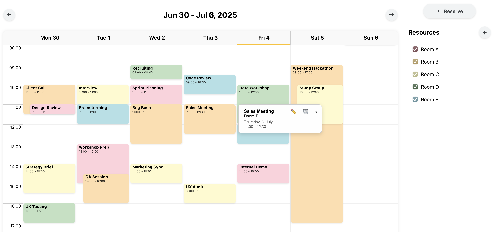

# Reservation System

A full-stack reservation system built with a React frontend and Spring Boot backend. This application allows users to view, create, edit, and delete reservations across multiple resources in a weekly calendar view.

## Preview



## Features

* 📅 Weekly calendar view
* 🏢 Multiple resource management
* ✏️ Create, edit, and delete reservations
* 🎨 Color-coded resources for easy identification
* 🔍 Resource visibility toggle in sidebar
* ⏰ Time-based grid with hourly slots

## Project Structure

```
reservation-system/
├── frontend/                 # React application
└── backend/                  # Spring Boot application
```

## Prerequisites

* **Node.js** (18)
* **npm** (10)
* **Java** (21)
* **Gradle** (8.14)
* **Docker** (20.10)

## Installation & Setup

### 1. Database Setup

You can run PostgreSQL using Docker:

```bash
docker run --name reservation-system \
  -e POSTGRES_USER=yourusername \
  -e POSTGRES_PASSWORD=yourpassword \
  -e POSTGRES_DB=reservation-system \
  -p 5432:5432 \
  -d postgres:15
```

You can customize the credentials.

### 2. Backend Setup

#### Run the Backend

```bash
cd backend
DB_USERNAME=yourusername DB_PASSWORD=yourpassword ./gradlew clean bootRun
```

The backend runs on `http://localhost:8080`.

### 3. Frontend Setup

```bash
cd frontend
npm install
npm start
```

The frontend runs on `http://localhost:3000`.

## Testing

### Backend Test

Run the integration test:
```bash
cd backend
DB_USERNAME=yourusername DB_PASSWORD=yourpassword ./gradlew test
```
